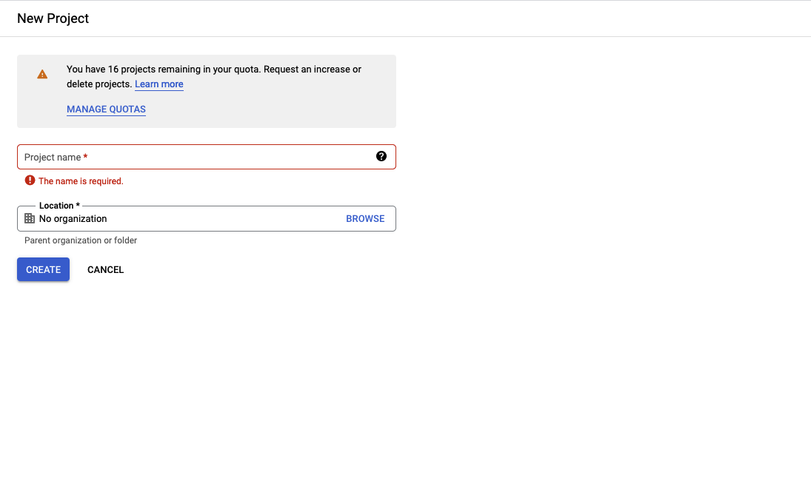
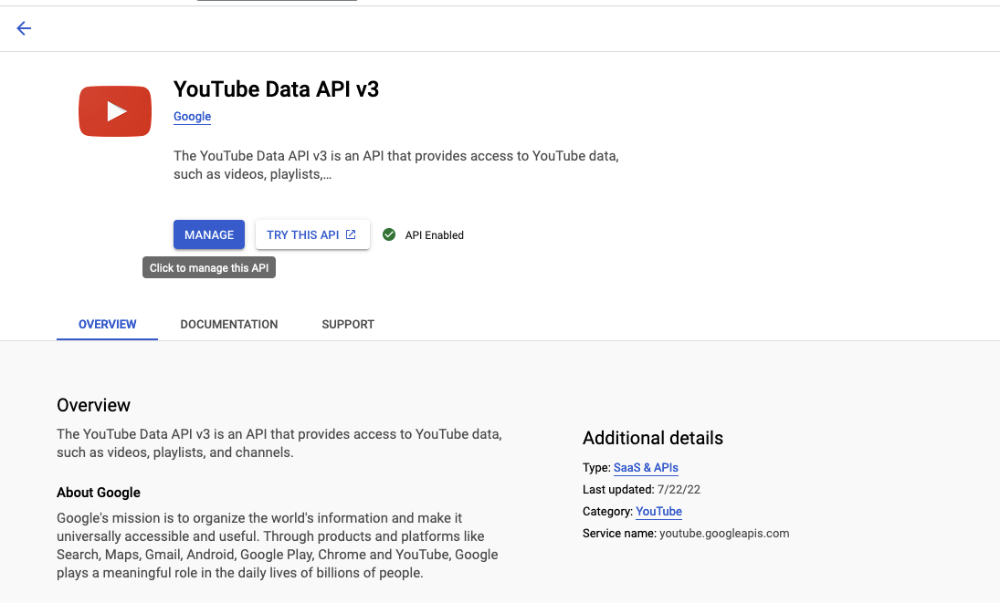

# Thumbnail Getter

Download thumbnails for videos of a particular YouTube channel.

## Requires

- Docker
- Docker compose
- Makefile

## Instructions

-1. (Make instructions better.)

0. Clone the repo:

```sh
git clone https://github.com/shivan-s/thumbnail-getter
```

1. [Login into the google console](https://console.cloud.google.com/) and create credentials. API should be fine.
   

2. Enable YouTube Data API v3 via the console.
   

3. Set up `.env` file (have a look at `.env.example`):

```sh
# .env
...
YT_APP_KEY=<PUT API KEY HERE>
...
```

4. Run programme:

```bash
make run
```

5. (optional) If you want to run logging at debug, set the environment variable:

```sh
# .env
...
LOGGING_LEVEL=DEBUG
...
```

## Contributing

Be nice. Also, ensure you have the above requirements (plus `pre-commit`)

Install pre-commit

```
pre-commit install
```

## TODOs

- [ ] Make thumbnail downloader async
- [ ] Write tests?
- [ ] Create a web app?
- [ ] Docs?
